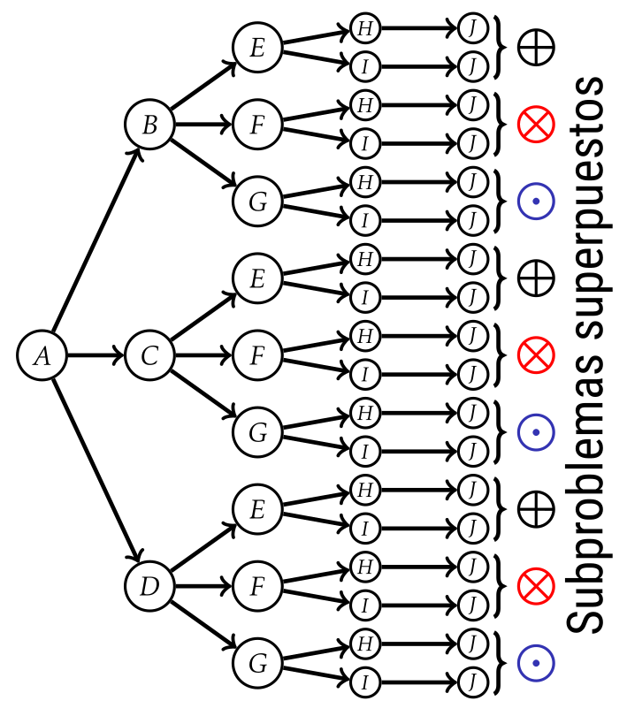

# Programación Dinámica

Usa la memoizacion para resolver problemas mas grandes en base a problemas
más pequeños.

- **Iterativo:** De abajo hacia arriba, **_calcula de más_** (Permite hacer tecnicas avanzadas de dp, por eso lo prefieren en **CP**)
  - Mas rapido
  -
- **Recursivo:** De arriba hacia abajo, **_calcula exactamente lo que necesita_**

Se crea una tabla de memoizacion para almacenar los subproblemas, generalmente
un `array` o `hashmap`

## Procedimientos

1. Formular el problema inicial usando subproblemas recursivos mas pequeños
2. Resolver esos subproblemas (con recursion u otros metodos) y guardar esas
   **soluciones parciales**
3. Usar las soluciones parciales junto con la opción mas beneficiosa para resolver
   subproblemas mas grandes.

> [!IMPORTANT]
> El analisis generalmente es:
> **tiempo de subproblema \* cantidad de subproblemas**

> [!NOTE]
> Los calculos se hacen una vez, para las siguientes
> consultas el tiempo es `O(1)`

> [!TIP]
> Cuando usar DP?
>
> 1. Contar algo, normalmente el numero de formas
> 2. Minimizar o maximizar cierto valor
> 3. Preguntas si/no

## Algoritmia

> [!CAUTION]
> Solo es optimo cuando los subproblemas se superponen, para usar memoizacion

### Componentes básicos en DP

- Etapa: Parte del problema donde se puede tomar una decision, y que tiene
  asociados estados
- Estado: Punto de decisión, donde se fija el valor de la decisión
- Asociaciones: Relaciones recursivas que llevan de un estado a otro
- Principio de optimalidad: En determinada decisión, las decisiones restantes
  son óptimas e independientes sin importar las decisiones que tomé antes.

## Problemas mas comunes

- El problema de la mochila
- Suma de subconjuntos
- Subconjunto incremental mas grande
- Contar todas los caminos en una matriz
- Subsecuencia comun mas larga
- Ruta mas larga en un DAG
- Encontrar la secuencia del palindromo mas largo
- Corte de varillas
- Distancia de corte

## SRTBOT

[Subproblema] -> [Relacion de recurrencia] -> [Orden topológico] ->
[Caso base] -> [Problema original] -> [Complejidad tiempo]
